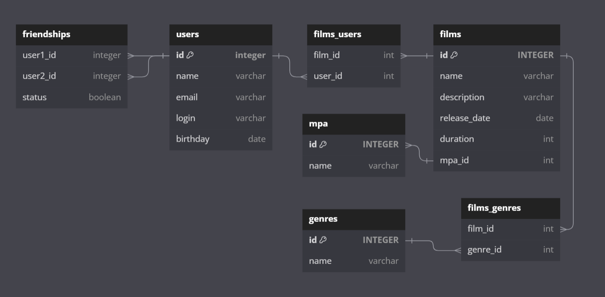

# java-filmorate
Template repository for Filmorate project.

В проект была добавлена новая логика.

H2 как для режима тестирования, которая будет хранить данные в памяти.
Это позволит базе быстро запуститься на время тестов и удалить все тестовые данные после их завершения, 
а также H2для рабочего режима, которая будет хранить данные в файле на жёстком диске. Это не позволит рабочим данным потеряться между запусками.

